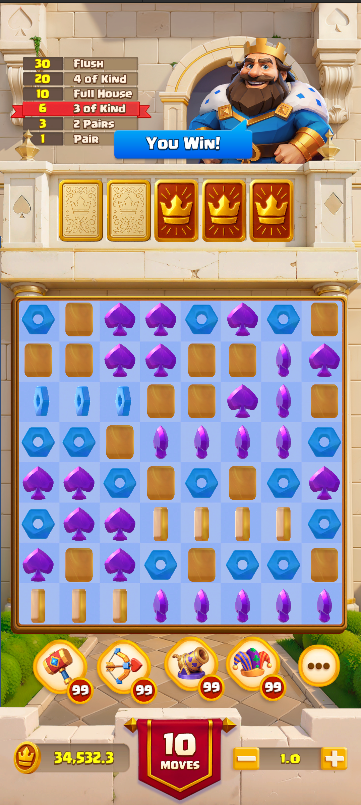

# UITest
The project is a match-3 puzzle game UI scene, integrating Spine animations, traditional UI elements, and 3D object animations. 

## Introduction
<p align="center">
    
</p>

It consist of two main parts:

* **UI Panel**: Displays the spine animation, UI elements like images and buttons.
* **Board Grid**: all tile elements of the board are placed in 3D world space.

The implemented functions are included as the following:
* Use **spine-unity plugin is 3.8** to match the provided Spine animation assets
* The scene includes two cameras :  **Main camera** renders the 3D board grid,  **UIcamera** renders the  UI elements.
* The UI uses **Screen Space - Camera** mode, allowing vfx(e.g., partical system) on UI elements without depth issues.
* Tile rotation animations are implemented using DOTween scripts.
* The tiles are randomly generated when playing the scene, and rotates if a match is detected 


## Setup
* This project was developed on Unity version `Unity 2021.3.9f1c1 lts`.
* The scene file is at `Assets/Scenes/Match3Scene.unity`

## Project hierarchy
```commandline
📦Assets
 ┣ 📂Scenes                         // Main Scene
 ┃ ┗ 📜Match3Scene.unity                   
 ┣ 📂Scripts                        // Main scripts used for roation animation
 ┣ 📂3D                             // Art sources for objs in game world
 ┣ 📂UI                             // Art sources for UI elements
 ┣ 📂Spine                          // Art sources for spine animation
 ┣ 📂Resource                       // resource files, like json file localization
 ┣ 📂Plugins                        // helpfuf asset store sources.
 ┣ ┗ 📂Dotween                      // animation system
 ┗ ┗ 📂Spine                        // spine animation
 ```


